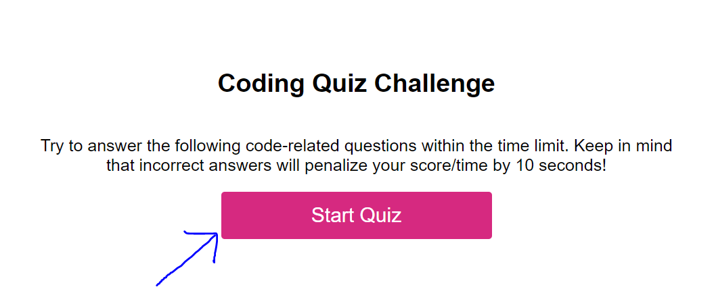
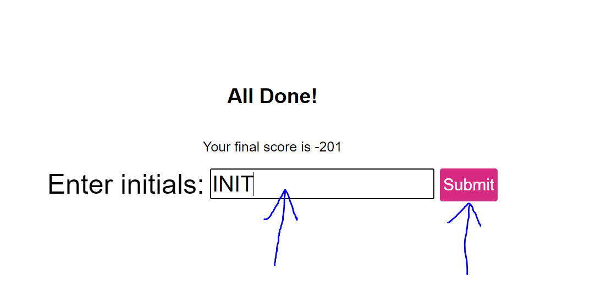
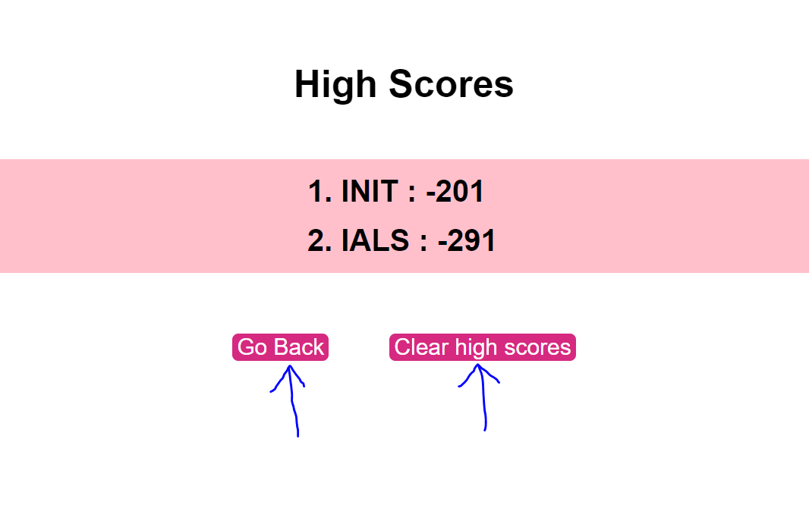

# <Code-Quiz>

## Description

This website was designed to provide a way for users to test their knowledge of how to code. The user begins with 20 seconds to answer a set of 5 questions. If the user answers a question wrong, 10 seconds will be subtracted from the total time. At the end, the user's total score is equal to the number of seconds left on the timer. Then, the user can input their initials, and they will be able to view their highscore on the Highscores page. On the highscores page is where they will find their new score and any other previous scores from themselves or any friends who took the quiz on their computer!

## Installation

N/A

## Usage

Click the button that says "Start Quiz"

The timer in the top right will begin with 20 seconds

For each question presented to you, answer to the best of your abilities. Once you answer, a new question will be presented to you.

Once you have answered the last question, your total score will be shown, and you will be able to enter your initials in the space provided for you. Hit enter or click the submit button to save your score.

You will then be redirected to the High Scores page where you can view your new score and previous ones by you or your friends on your computer.
Click "Go Back" to take the quiz again, or click "Clear high scores" to erase all the previously saved scores.

## Bug Reports

The total score displayed at the end of the quiz is the culmination of the times being subtracted from each question and the question(s) before it. For example, if you click question one's correct answer, A, no time is subtracted. If you then click question two's correct answer, B, it will not subtract any time from question two but will subtract 10 seconds because it is also using your answer B to answer the previous question, which is incorrect. This continues down to question five and results in a large negative value for the score.

## Credits

<li><a href="https://www.youtube.com/watch?v=sqUFaKGaEyE">Connect multiple pages to one HTML</a></li>

<li><a href="https://www.w3schools.com/howto/howto_js_trigger_button_enter.asp">How to make enter equal a button click</a></li>

<li><a href="https://www.kirupa.com/html5/event_capturing_bubbling_javascript.htm#tutorialInformation
">Event Bubble Explanation</a></li>

<li><a href="https://www.youtube.com/watch?v=2hJ1rTANVnk&t=210s">Using Local Storage for an Array</a></li>